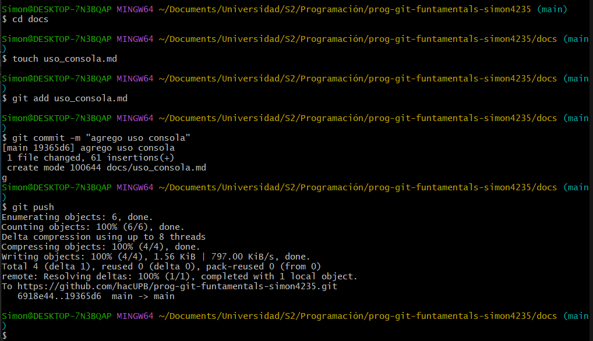

# Creación de un Repositorio Local con Git

Un repositorio local es tu propia copia del historial de tu proyecto, almacenada en tu máquina. Es donde Git rastrea los cambios que haces en tus archivos y donde puedes trabajar de forma independiente antes de compartir tus avances. Crear uno es el primer paso para usar control de versiones en cualquier proyecto.

## Pasos para Crear un Repositorio Local

A continuación, se detalla el proceso para inicializar un repositorio Git localmente en tu sistema.

Creación de un Repositorio Local con Git
Un repositorio local es donde Git rastrea los cambios en tus archivos en tu propia máquina.

Pasos para crear un repositorio local:
1. Abrir la terminal: Navega hasta la carpeta raíz de tu proyecto usando el comando `cd`.

2. Inicializar el repositorio: Ejecuta el siguiente comando para crear la carpeta oculta `.git`:

```

git init

```

3. Añadir archivos al área de preparación (Staging): Indica a Git qué archivos quieres rastrear:

```

git add .

```

4. Realizar el primer commit: Registra los cambios en el historial:

```

git commit -m "Primer commit: inicialización del proyecto"

```

5. Verificar el estado: Puedes usar `git status` en cualquier momento para ver el estado de tus archivos.

## Ejemplo push  
  

## Comandos para hacer commit
