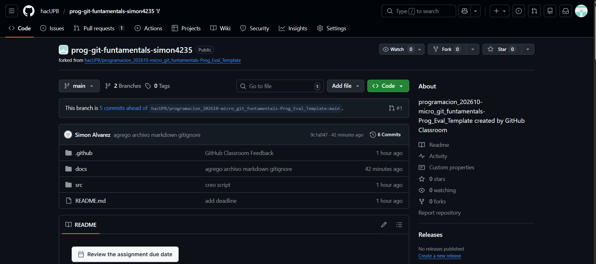

Repositorio Remoto en GitHub y Sincronización
Sincronizar tu trabajo local con la nube permite respaldar tu código y colaborar con otros.

Proceso de creación y sincronización:
1. Crear el repositorio en GitHub

• Inicia sesión en GitHub(https://github.com).

• Haz clic en el botón "+" y selecciona "New repository".

• Ponle un nombre y haz clic en "Create repository" (no marques la opción de inicializar con README si ya tienes un proyecto local).

2. Vincular el repositorio local con el remoto

Copia la URL de tu repositorio de GitHub y ejecútalo en tu terminal:

```

git remote add origin [enlace sospechoso eliminado]

```

3. Renombrar la rama principal (opcional/recomendado)

Asegúrate de que tu rama se llame `main`:

```

git branch -M main

```

4. Subir los archivos (Push)

Envía tus cambios locales a GitHub por primera vez:

```

git push -u origin main

```

A partir de ahora, solo necesitarás usar `git push` para subir tus nuevos cambios.

## Ejemplo repositorio remoto

